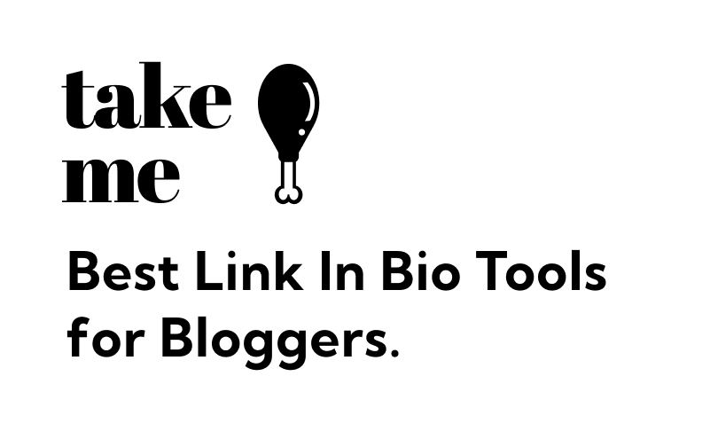
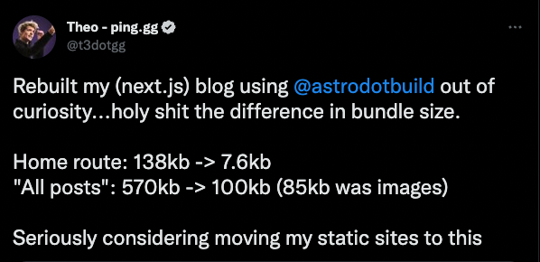

# takemethere-mono

TakeMe is a link-in-bio tool built for Food/Restaurant bloggers. Heavily inspired by all the other link-in-bio tools, it has most of the **basic** features of a link-in-bio tool but with a couple key differences.

[demo](https://takeme.blog/lefan)\
[demo2](https://takeme.blog/evana)

#### Basic Features

1. Preview of your TakeMe link in the Admin Page
2. Track analytics (Clicks currently) of your individual Page entries (Links, Reviews, Audio snippet, Blogs)
3. Reorder links or hide them when desired.

#### Special(?) Features

1. Reviews - You can write your personal reviews for restaurants (ratings, 2 buttons for external links, short review)
2. Write Blogs - TakeMe has a basic blogging feature that allows you to write your own blog articles and displaying it on your TakeMe link with minimal hassle.
3. Audio Snippet - You can add audio clips to your website. Totally unrelated to Food Blogging in general, but adds a layer of personalization to your TakeMe Links.

## Development

The required service needed for everything to work locally is

1. Postgres DB - run `docker compose up` to spin up a containerized postgres server.
2. Admin - run `cd admin && npm run dev`
3. Blog (TakeMe Links) - run `cd blog && npm run dev`
4. WebAPI - run `cd webapi && npm run dev`

## Services

### Admin

Stack: **Vite, Vue, Quasar, Tailwind**\
Path: https://takeme.blog/admin

Deployed to cloud using Firebase Hosting, through github actions when anything changes in the `/admin` or `/common/` path.

I'm having fun using Quasar (and pinia) and slowly loving Vue for building SPAs. Quasar was a little difficult to customize at first, but once you get the hang of it, you can style it however you want.

Using firebase hosting configs and changing the base path of this project, I was able to route everything `/admin/**` to the Admin project, and everything `/**` to the Blog project

### Blog (User Facing)

Stack: Astro, Vue and Tailwind\
Path: https://takeme.blog

Deployed to cloud using Google Run because a server runtime is required for Astro SSR.
CI/CD happens through Cloud Build with a trigger setup to deploy automatically to production on merge to `main`. And of course a staging environment is needed in **_real_** production.

Thoughts on (Astro)[https://docs.astro.build/en/getting-started/]:

#### **The Pros**

Astro is a really exciting framework for mostly static websites, main reason being it's ability to do partial hydration and lazy loading on _islands_(interactive components that requires javascript). Astro generates most of the pages into HTML and strips **a lot** of unnecessary JS before sending it down to the browser. As opposed to Next that hydrates the entire page and therefore requires a larger bundle. Check out the following numbers that someone made comparing NextJS and Astro

TakeMe's pages are also seeing an insane score on PageSpeed, average at around 94 (using SSR, not even SSG!), while LinkTree's statically generated NextJS page is average at around 38.

More on (benefits of Astro's islands)[https://docs.astro.build/en/concepts/islands/#what-are-the-benefits-of-islands]

#### **The not so pros**

Astro while having a great ecosystem and community, is still pretty new. As a result, not everything works as expected. The node server that's doing SSR doesn't have any error reporting(?), so if anything goes wrong during runtime, you'd have to guess what's happening.

Error logging is also weird with the development server, sometimes logging errors that are completely unrelated to the actual problem. Not all components are perfectly typed as well, which is fair because things are constantly being updated by the Astro dev team.

### WebAPI

Stack: Express, Typescript, Prisma and Esbuild\

Also deployed to cloud using Google Run.
CI/CD happens through Cloud Build with a trigger setup to deploy automatically to production on merge to `main`. And of course a staging environment is needed in **_real_** production.

Express is easy to setup, but it can get messy and confusing as your service gets bigger, having everything start with `express.use('/user/:userId/page/:pageId', (req, res) => {)` doesn't make things easier either.

Another important aspect of a backend framework that could be easily dismissed (at least for me), is the ease of generating an OpenAPI schema. When paired with an (OpenAPI typescript codegen)[https://www.npmjs.com/package/openapi-typescript-codegen], it means that your backend service can generate a **TYPE SAFE** client that your frontend can call **DIRECTLY**, you wouldn't know you miss it until you start building full stack apps without this DX feature.

### Google PubSub + Scheduler + Function

Pretty straight forward, the function calls a dummy endpoint for the WebAPI and Blog service once every couple minute to keep the services 'warm' and reduce cold start latency.

## Future

1. Add a staging environment
2. Front the takeme.blog/[user] links and Google storage with a CDN
3. Paginate some of the response being returned

## Take aways / Learnings

1. Use a backend framework that resembles a MVC architecture (TSed, NestJs) more, as oppposed to just using Express. More structure, better OpenAPI schema generation?
2. I need to improve my backend skills more lol!
